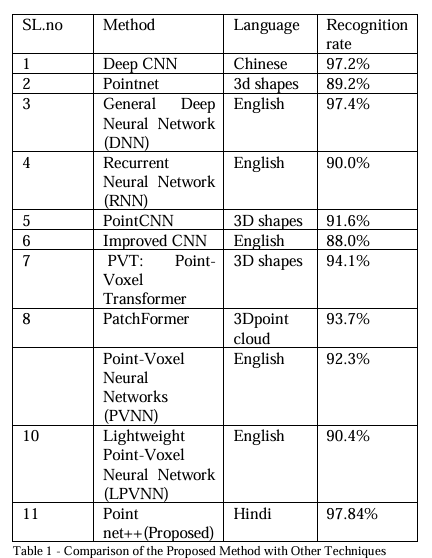
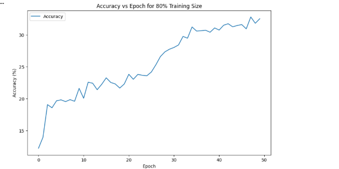
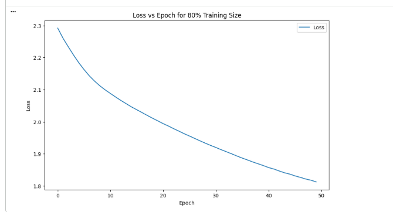
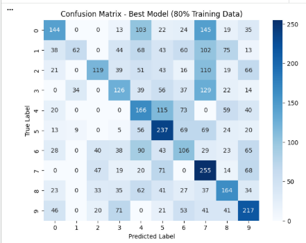
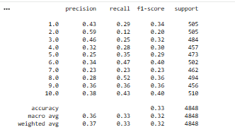

# Hindi Air-Writing Gesture Recognition using Leap Motion and PointNet++

A deep learning-based system for recognizing Hindi air-written characters using **PointNet++** and the **Leap Motion Controller**. The system captures 3D hand movement data, preprocesses it into point clouds, and classifies handwritten Hindi characters without requiring physical contact.

---

## Project Overview

Traditional handwriting recognition requires physical input devices such as pens, keyboards, or touchscreens. This project introduces a touchless handwriting recognition system that enables users to write Hindi characters in the air using hand gestures captured by the Leap Motion Controller.

The captured 3D point cloud data is processed using the PointNet++ deep learning architecture to recognize handwritten Hindi characters accurately.

---

## Features

- Touchless Hindi character recognition
- 3D hand tracking using Leap Motion Controller
- Point cloud preprocessing
- Deep learning classification using PointNet++
- Performance evaluation using multiple metrics

---

## Tech Stack

- Python
- PointNet++
- PyTorch
- Leap Motion SDK
- NumPy
- Matplotlib
- Google Colab

---

## Repository Structure

```
hindi-air-writing-gesture-recognition/
│
├── dataset/
├── images/
├── notebooks/
├── paper/
├── results/
├── README.md
├── requirements.txt
├── LICENSE
└── .gitignore
```
---

# Performance Comparison

The proposed PointNet++ model was compared with several existing gesture recognition techniques.



---

# Training Accuracy

The model demonstrates a steady improvement in accuracy over the training epochs.



---

# Training Loss

Training loss decreases consistently, indicating effective model learning.



---

# Confusion Matrix

The confusion matrix illustrates the classification performance across different Hindi character classes.



---

# Classification Report

Precision, Recall, and F1-Score obtained for each class.



---


# Research Paper

The complete research paper describing the methodology, implementation, and evaluation is available in the **paper/** directory.

---

# Future Improvements

- Increase dataset size
- Improve recognition accuracy
- Support additional Hindi characters
- Optimize real-time inference
- Develop a desktop/web application

---

# Author

**Steena Susan Abraham**

BCA Data Science Graduate

Machine Learning | Deep Learning | Computer Vision
